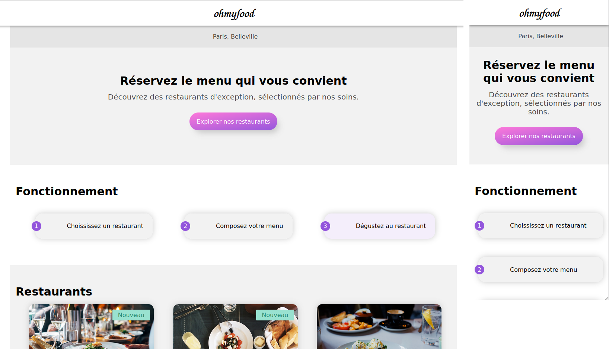

# ohmyfood
English version below!

Ohmyfood! est une jeune startup qui voudrait s'imposer sur le marché de la restauration. L'objectif est de développer un site 100% mobile qui répertorie les menus de restaurants gastronomiques.

Vous pouvez retrouver le [brief complet ici](https://s3-eu-west-1.amazonaws.com/course.oc-static.com/projects/DW_P3/Brief%20cre%CC%81atif%20-%20Ohmyfood!.pdf)

**BUTS DU PROJET**:

- Mettre en œuvre des effets CSS graphiques avancés
- Mettre en place une structure de navigation pour un site web
- Utiliser un système de gestion de versions pour le suivi du projet et son hébergement

**Liens utiles**

- [Website 🌎](https://benjaminlesne.github.io/ohmyfood/)
- [Source code 📖](https://github.com/BenjaminLesne/ohmyfood/)

### Animation

**Boutons**

- Au survol, la couleur de fond des boutons principaux devra légèrement s’éclaircir. L’ombre portée devra également être plus visible.
- À terme, les visiteurs pourront sauvegarder leurs menus préférés. Pour ça, unbouton "J’aime" en forme de cœur est présent sur la maquette. Au clic, il devra se remplir progressivement. Pour cette première version, l’effet peut être apparaître au survol au lieu du clic.

**Page d’accueil**

- Quand l’application aura plus de menus, un “loading spinner” sera nécessaire. Sur cette maquette, nous souhaitons en avoir un aperçu. Il devra apparaître pendant 1 à 3 secondes quand on arrive sur la page d'accueil, couvrir l'intégralité de l'écran, et utiliser les animations CSS (pas de librairie). Le design de ce loader n’est pas défini,toute proposition est donc la bienvenue tant qu’elle est cohérente avec la chartegraphique du site.

**Pages de menu**
- À l’arrivée sur la page, les plats devront apparaître progressivement avec un léger décalage dans le temps. Ils pourront soit apparaître un par un, soit par groupe “Entrée”, “Plat” et “Dessert”. Un exemple de l’effet attendu est fourni.
- Le visiteur peut ajouter les plats qu'il souhaite à sa commande en cliquant dessus. Cela fait apparaître une petite coche à droite du plat. Cette coche devra coulisser dela droite vers la gauche. Pour cette première version, l’effet peut apparaître au survolau lieu du clic. Si l’intitulé du plat est trop long, il devra être rogné avec des points de suspension. Un exemple de l’effet attendu est fourni

## Technologies

**Autorisés:** HTML / CSS / Sass

**Recommandée:** HTML / Sass

**Interdit:** Javascript / Frameworks CSS / Inline CSS

**Contraintes :**
- Approche mobile-first: oui
- Maquette mobile : fourni
- Maquette desktop : à improviser
- Validation W3C HTML : à passer, warning autorisés
- Validation W3C CSS : à passer, warning autorisés
- Compatibilité : Chrome, Firefox

# ENGLISH VERSION

Ohmyfood! is a young startup that would like to impose itself on the restaurant market. The objective is to develop a 100% mobile site that lists the menus of gourmet restaurants.

You can find the [full brief here](https://s3-eu-west-1.amazonaws.com/course.oc-static.com/projects/DW_P3/Brief%20cre%CC%81atif%20-%20Ohmyfood!.pdf)

**PROJECT GOALS**:

- Implement advanced graphic CSS effects
- Implement a navigation structure for a website
- Use a version management system for project tracking and hosting

**Useful links**

- [Website 🌎](https://benjaminlesne.github.io/ohmyfood/)
- [Source code 📖](https://github.com/BenjaminLesne/ohmyfood/)

### Animation

**Buttons**

- When hovering, the background color of the main buttons should lighten slightly. The drop shadow should also be more visible.
- Eventually, visitors will be able to save their favorite menus. For this, a heart-shaped "Like" button is present on the model. When clicked, it should fill up progressively. For this first version, the effect can be shown on the hover instead of the click.

**Home page**

- When the application will have more menus, a loading spinner will be necessary. On this mockup, we want to have a preview of it. It will have to appear for 1 to 3 seconds when we arrive on the home page, cover the whole screen, and use CSS animations (no library). The design of this loader is not defined, so any proposal is welcome as long as it is consistent with the graphic charter of the site.

**Menu pages**
- Upon arrival on the page, the dishes should appear progressively with a slight delay in time. They can either appear one by one, or in groups "Starter", "Main course" and "Dessert". An example of the expected effect is provided.
- The visitor can add the dishes he wants to his order by clicking on them. A small tick appears to the right of the dish. This tick should slide from the right to the left. For this first version, the effect can appear on the hover instead of the click. If the title of the dish is too long, it should be trimmed with ellipsis. An example of the expected effect is provided

## Technologies

**Allowed:** HTML / CSS / Sass

**Recommended:** HTML / Sass

**Prohibited:** Javascript / CSS Frameworks / Inline CSS

**Constraints:**
- Mobile-first approach: yes
- Mobile mockup: provided
- Desktop layout: to be improvised
- W3C HTML validation: to be passed, warning allowed
- W3C CSS validation: to be passed, warnings allowed
- Compatibility: Chrome, Firefox

## Installation

- Clone this repository
- Open the index.html with the VS code extension live server
- Enjoy the website on localhost:3000 (default)

## License

This project is part of the OpenClassrooms [Front-End Developer](https://openclassrooms.com/fr/paths/314-developpeur-front-end) course. The code is freely reusable, but the images / logo / figma mock-up do not belong to me.

If you are also an OC student, you can freely draw inspiration from my work, but I obviously do not recommend copying parts of it.

